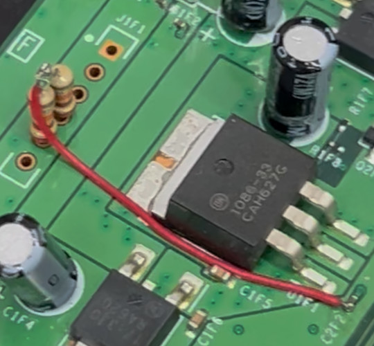

# EXT+3 installation, Xenon and Elpis boards

## An important note about southbridges

Xenon boards use the well-known XSB southbridge, with production models made through 2006 using the old
G0 revision. Around 2007 Microsoft introduced the R0 revision, which was also used on Zephyr and
Falcon boards. While R0 was mostly a bugfixed chip, it broke compatibility with some SMC code.

The Xenon SMC code I used as a base is version 1.51. This has only been tested against a G0 console,
and it should work for R0 consoles, but if it doesn't, please submit a bugreport.

## And now, the actual wiring

The glitch chip wiring is the same as EXT_CLK, but here it is again in case you're doing a new install.

- A = /CPU_RST_1V1P_N
- B = FT6U1 (POST bit 0)
- C = STBY_CLK
- F = CPU_EXT_CLK_EN

You will also need two 22k ohm resistors and two 1N400x diodes, which are soldered to the debug LED
port similar to how JTAG does it. The 22k resistors are used as pullups; without them, the SMC code won't
be able to detect POST state changes. **If you try to run the SMC code without the pullups, you'll get a
RRoD.**

First, solder the 22k pullups into the DBG_LED1 and DBG_LED2 holes, common one side of them together, and
then route 3v3 to the commoned side. Here's an example of how that's done:

After installing the pullups, connect DBG_LED1 and DBG_LED2 to the POST pins via diodes as follows:

- DBG_LED1 --> diode --> FT6U2 (POST bit 6)
- DBG_LED2 --> diode --> FT6U8 (POST bit 7)

Here's a professionally made diagram showing where you should solder things. Route wires at your own discretion.
It's better to keep your wires short and to avoid the high speed busses and power rail inductors whenever possible.

Connect your Matrix or whatever to your programmer, **MAKING SURE YOU AREN'T CONNECTING IT IN REVERSE
POLARITY BECAUSE YOU WILL FRY THE GLITCH CHIP IF YOU DO.** Most Matrix chips don't come with a pin
header; if you're looking for one, it's just standard 2.54mm pitch male pins. You can get long strips of them
and cut them to fit.

In J-Runner, click "Program Timing Files". Then, select Program -> Choose timing file, and choose the
timing file you want to program. You should see the thing program your Matrix. Awesome job, your chip's
programmed. You might need to program it multiple times before you're satisfied, so keep your programmer
around.

The timing file you should start with is `ext3_192mhz_d8002_pw2.xsvf`. Play around with them until you find
one that your console likes. Additional pulse widths are provided in case your console likes wider
pulse widths.

## XeLL ECCs

Three ECCs are provided here:

- `rgh13_xenon.ecc` uses the old CB 1940, which boots faster, but might have compatibility issues.
- `rgh13_xenon_5772.ecc` uses the Falcon CB 5772, which boots slower, and is more compatible, except with Elpis boards.
- `rgh13_elpis.ecc` uses the Elpis CB 7378, which should be the most compatible.

