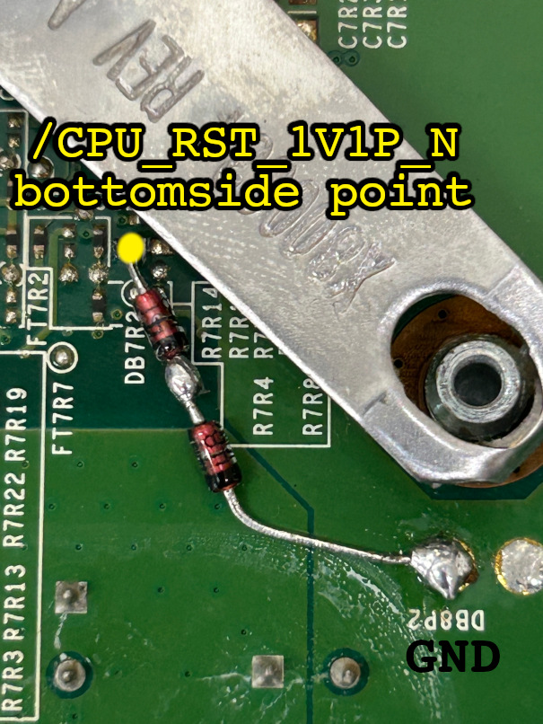
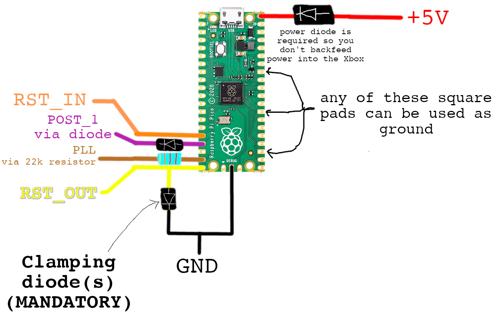
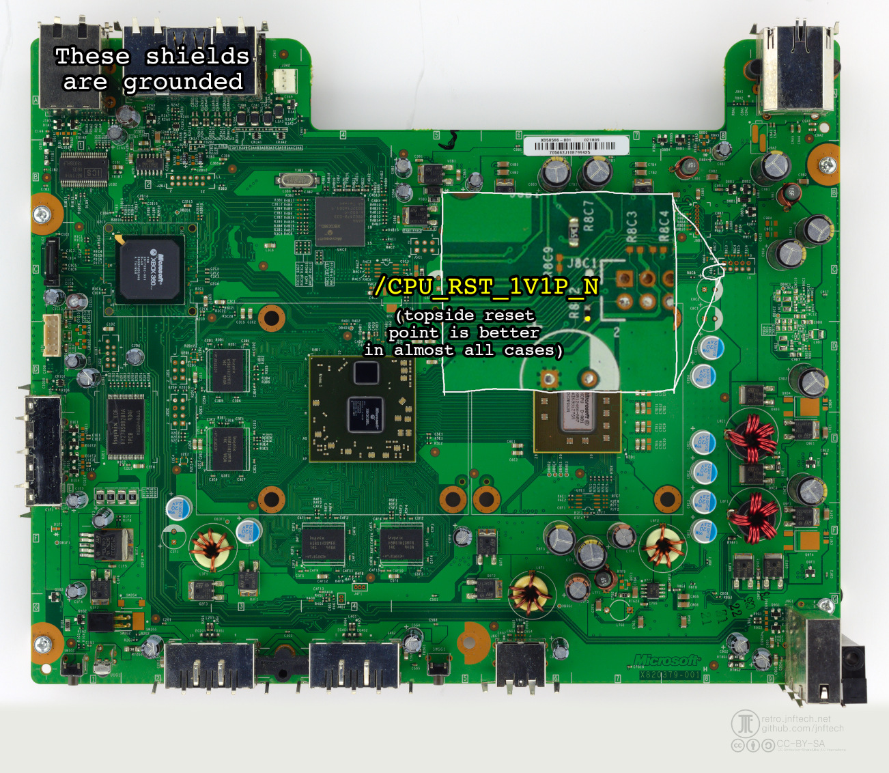
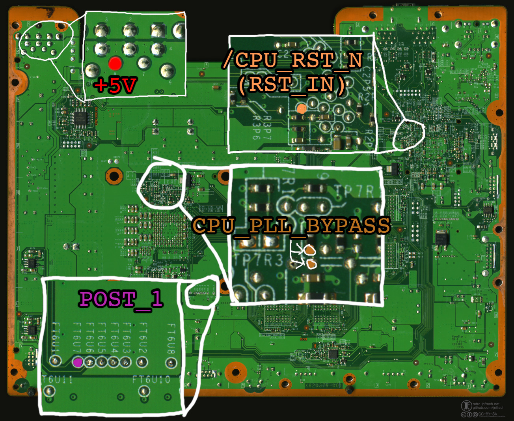

# RGH1.3 installation with Raspberry Pi Pico, Falcon/Jasper

RGH1.3 was created with the intent of speeding up glitch attempts on the Pico so it's only natural that
Picos are supported. **Using a Pico doesn't produce results as good as a glitch chip** because the
Pico is unable to run in sync with the standby clock, **and it's kinda dangerous** because you're interfacing
3v3 to a 1v1 device. That said, it works well enough that you can throw one into a Falcon.

## Shit ya need

You will need:
- A supported RP2040-based device (supported are: Raspberry Pi Pico)
- 1x 22k ohm resistor for interfacing to the PLL point
- One or two fast or ultrafast diode(s) (less than 5 ns recovery time) -- **THIS IS NON NEGOTIABLE!**
- 1x any diode for interfacing to the POST bus
- 1x 1N400x power diode to prevent power from backfeeding into the Xbox
- Lotsa wires
- Heatshrink
- The usual soldering crap

## Programming your Pico

Grab a .uf2 [here](rgh13-rp2040-uf2/).

1. Hold BOOTSEL and plug the Pico into your PC.
2. Look for a newly mounted USB drive called "RPI-RP2".
3. Drag and drop the .uf2 of your choice into it. The drive will unmount when completed,
   likely rudely with a "you didn't properly eject that drive" message.

Once this is done, unplug the Pico from your system, then plug it back in, this time without holding BOOTSEL.
To verify that the thing was programmed, you now need to get to the REPL prompt. I use [Thonny](https://thonny.org/)
to do this; there are plenty of tutorials online to how to connect to your device, such as [this one)(https://github.com/thonny/thonny/wiki/MicroPython).
And yes, there's a reason I'm making you download this crappy IDE. Bear with me for now.

When you connect to the device (and press STOP to drop to the prompt), you should see the following text, or something like it appear:
```
MicroPython v1.25.0 on 2025-04-15; Raspberry Pi Pico with RP2040
Type "help()" for more information.
```

You should also see, on the "RP2040 Device", that there exist `main.py` and `rgh13_1wire.py`. Excellent, your device is programmed. Now you can
unplug it from your computer... for now.

## Beware the Voltage Spike of Doom

**DANGER: This method directly interfaces 3v3 to a 1v1 I/O line.** RGH requires that the reset line be
pulled up immediately, rather than letting it float. This will send a 3v3 spike into your CPU, which, while
it's only a few nanoseconds short, can damage the CPU and kill it in the long term.

To limit the chance of your CPU getting damaged, you MUST install a clamping diode, or diodes, across the
reset line so that the voltage on the line does not exceed 1.5v. They must switch as fast as possible, and
must also not interfere with proper operation.

**The anode connects to /CPU_RST_1V1P_N; the cathode connects to ground.** An example using 1N4148 diodes,
which is NOT guaranteed to be safe and is only really here for illustrative purposes:



## Wiring stuff to other stuff

Feast your eyes on the following diagrams.

**Raspberry Pi Pico:**



In summary:

- GPIO12 = reset input, to /CPU_RST_N (3v3 reset solderpoint under the southbridge)
- GPIO13 = POST bit 1 input (via diode)
- GPIO14 = PLL (via 22k resistor)
- GPIO15 = reset output, to /CPU_RST_1V1P_N (normal reset solder point)
- VBUS = +5V, can be from USB or standby (standby preferred), MUST be connected via a power diode (see below)
- GND = ...well, ground????

**IMPORTANT!** You need to connect +5V to VBUS via a diode to prevent backfeeding power into the Xbox.
Failing to do so will cause issues with your console and your computer if you later decide to connect the
Pico to your computer for tuning and program updates.

And here's where to solder, assuming you're using RGH1.3 zero-wire POST:





**If you want to use any of the one-wire or two-wire POST methods:** The other documents should show you
where to run the extra diodes or hack your board up horribly. I'm not repeating that here because it's messy.

Once everything is wired up correctly, and you've flashed XeLL, power the console on. It should boot
within a couple of attempts. If all you see is a single blinking red light on the Ring of Light,
something is wrong (or, and this is less likely, you have a bad Jasper).

Now you can grab your CPU key. Great job. Go build your NAND, convert it to RGH1.3, flash it, and meet
me back here once you see your system boots successfully.

## Tuning boot times (power users only)

Remember how I made you download Thonny and test it out? Here's why: you need to tune this thing.

There are two relevant lines you should change in rgh13_1wire.py to better tune the program.

First is the reset delay:

```
# ------------------------------------------------------------------------
#
# Important Configuration Stuff
#
# ------------------------------------------------------------------------

RESET_DELAY            = 349821  # <-- start at 349821
```

The second is the pulse width:
```
    jmp(y_dec, "19")                      # 19
    set(pindirs, 3)                  [3]  # <-- PULSE WIDTH: USE [1], [2] OR [3]
    set(pins, 3)                          # 21
    set(pindirs, 1)                       # 22
```
