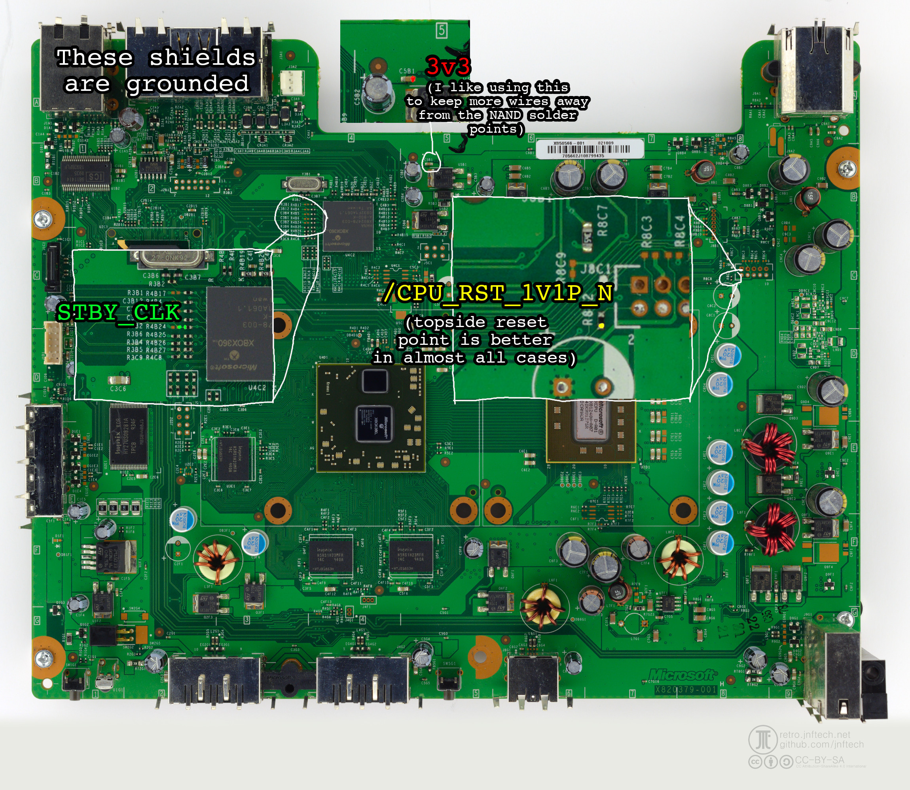
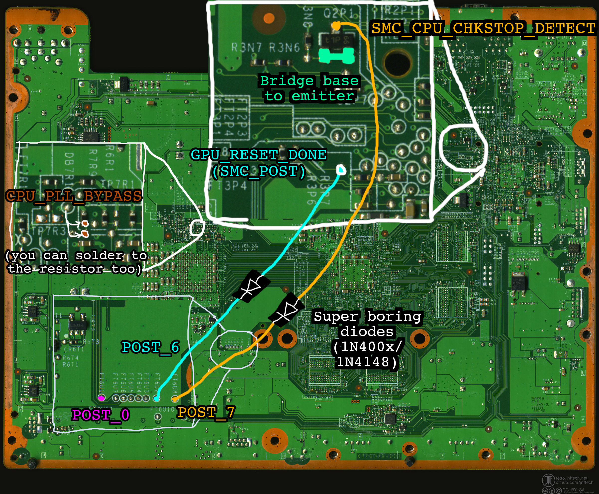

# RGH1.3 installation, SMC_CPU_CHKSTOP_DETECT for POST 7, Falcon/Jasper

The chkstop method is yet another installation method for RGH1.3. It uses the SMC_CPU_CHKSTOP_DETECT
line, normally used for debugging, to track POST bit 7 state changes.

Checkstop is a signal output by the PowerPC CPU that says "hey, there's been a major software error,
maybe you should do something about it." However, the retail SMC on Jasper and Falcon only reads the
bit, sets some flags somewhere, and does nothing else. If you keep the checkstop signal asserted,
the Xbox will happily boot to the dashboard with no complaints or RRoD.

## Installing

Glitch chip wiring isn't different from what you already know, but here it is again.

Matrix:
- A = /CPU_RST_1V1P_N
- B = FT6U1 (POST bit 0)
- C = STBY_CLK
- F = CPU_PLL_BYPASS

The transistor at Q2P1 is key to the whole thing. It's a SOT-23 NPN transistor with a B/E/C pinout.
You will need to disable the transistor; to do so, bridge the base to the emitter with a solder blob.

You will also need two diodes (1N400x slow power diodes will work, speed's not critical here):

- GPU_RESET_DONE/SMC_POST --> diode --> FT6U2 (POST bit 6)
- Q2P1 collector (SMC_CPU_CHKSTOP_DETECT) --> diode --> FT6U8 (POST bit 7)

Here's a professionally made diagram showing where you should solder things. Route wires at your own discretion.
It's better to keep your wires short and to avoid the high speed busses and power rail inductors whenever possible.

Connect your Matrix or whatever to your programmer, **MAKING SURE YOU AREN'T CONNECTING IT IN REVERSE
POLARITY BECAUSE YOU WILL FRY THE GLITCH CHIP IF YOU DO.** Most Matrix chips don't come with a pin
header; if you're looking for one, it's just standard 2.54mm pitch male pins. You can get long strips of them
and cut them to fit.

In J-Runner, click "Program Timing Files". Then, select Program -> Choose timing file, and choose the
timing file you want to program. You should see the thing program your Matrix. Awesome job, your chip's
programmed. You might need to program it multiple times before you're satisfied, so keep your programmer
around.

The timing file you should start with is `rgh13_pw2_d21.xsvf`. Play around with them until you find
one that your console likes. Additional pulse widths are provided in case your console likes wider
pulse widths.

**For people wanting to use the bodge capacitor:** RGH1.3 glitches so rapidly that you'll get misleading
results with the glitch chip's blinking LED. The SMC code can catch major CPU issues (see error handling
info below) but it won't be able to diagnose how much noise is on the PLL line.

Tips for capacitor users:
- 68 nF (0.068 uF) and 100 nf (0.1 uF) are the common capacitor values
- Matrix users MUST ensure the glitch chip AND the capacitor are properly grounded or there will be too much noise
- You can see how the glitch chip LED behaves under RGH1.2 to better diagnose PLL noise
