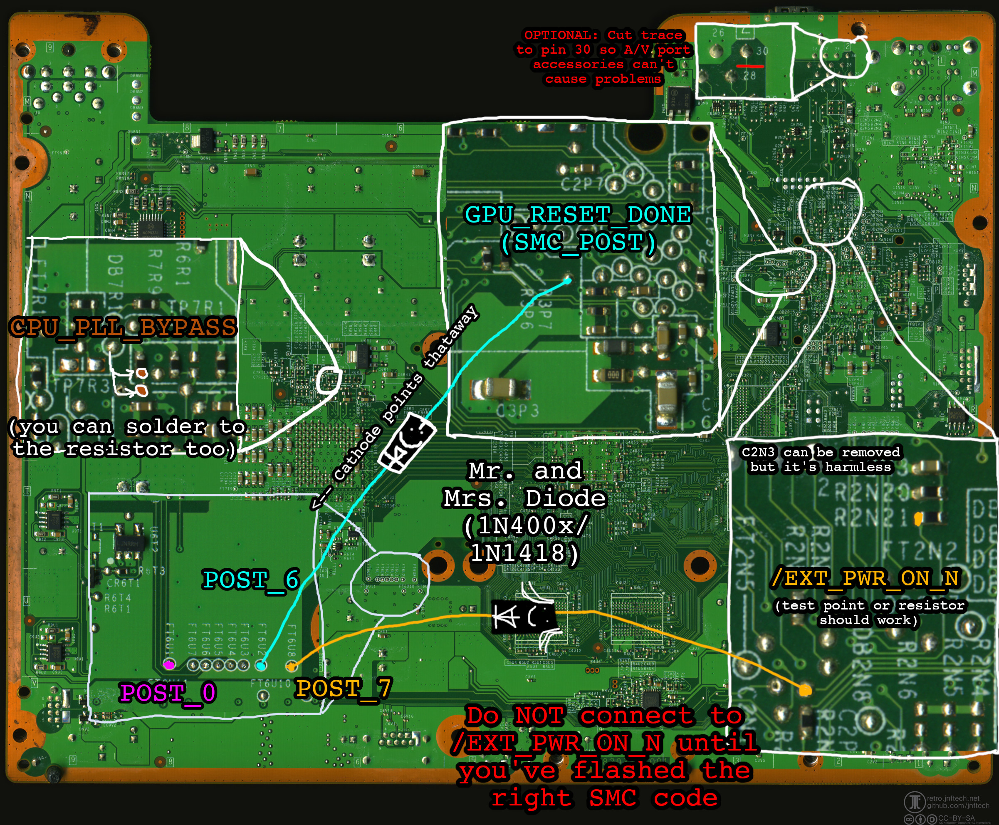

# RGH1.3 installation, EXT_PWR_ON_N for POST 7, Falcon/Jasper

The extpwr method for RGH1.3 is an alternative method for people who don't want to hack up their
boards or lose the tiltswitch functionality. It uses the little-used /EXT_PWR_ON_N signal, which is
normally used by kiosks and debug tools to power the system up instead of the front panel buttons.
However, it is more annoying to install because the wire routing isn't ideal and because the SMC
will power the system on automatically unless you've flashed the right SMC program.

## The important bit: Flash BEFORE you wire things up!

When /EXT_PWR_ON_N is connected to ground, the SMC is programmed to power the system on. If you aren't
using an extpwr SMC and you connect /EXT_PWR_ON_N to POST bit 7 via a diode, your system will power on
when you don't want it to. You're free to solder the rest of the wiring before you connect POST bit 7.

**Your system MUST be powered off before you flash an image.** If you flash the wrong image by accident
or connect /EXT_PWR_ON_N too early and your system powers up, you'll have to desolder the wire, flash the
right image, and then try again. 

## Installing

Glitch chip wiring isn't different from what you already know, but here it is again.

Matrix:
- A = /CPU_RST_1V1P_N
- B = FT6U1 (POST bit 0)
- C = STBY_CLK
- F = CPU_PLL_BYPASS

You will also need two diodes (1N400x slow power diodes will work, speed's not critical here):

- GPU_RESET_DONE/SMC_POST --> diode --> FT6U2 (POST bit 6)
- /EXT_PWR_ON_N --> diode --> FT6U8 (POST bit 7)

**Optional trace cut:** /EXT_PWR_ON_N connects to pin 30 on the A/V port, so it's possible that something
connected to the A/V port could interfere with the SMC program. Virtually all A/V cables don't use this, but if you
are worried that something might interfere with the boot process, you can cut the trace going to pin 30.

**Optional capacitor removal:** C2N3 acts as a debouncing capacitor for the /EXT_PWR_ON_N line. In testing I found
it to be harmless, but it can be desoldered.

Here's a professionally made diagram showing where you should solder things. Route wires at your own discretion.
It's better to keep your wires short and to avoid the high speed busses and power rail inductors whenever possible.

Connect your Matrix or whatever to your programmer, **MAKING SURE YOU AREN'T CONNECTING IT IN REVERSE
POLARITY BECAUSE YOU WILL FRY THE GLITCH CHIP IF YOU DO.** Most Matrix chips don't come with a pin
header; if you're looking for one, it's just standard 2.54mm pitch male pins. You can get long strips of them
and cut them to fit.

In J-Runner, click "Program Timing Files". Then, select Program -> Choose timing file, and choose the
timing file you want to program. You should see the thing program your Matrix. Awesome job, your chip's
programmed. You might need to program it multiple times before you're satisfied, so keep your programmer
around.

The timing file you should start with is `rgh13_pw2_d21.xsvf`. Play around with them until you find
one that your console likes. Additional pulse widths are provided in case your console likes wider
pulse widths.

**For people wanting to use the bodge capacitor:** RGH1.3 glitches so rapidly that you'll get misleading
results with the glitch chip's blinking LED. The SMC code can catch major CPU issues (see error handling
info below) but it won't be able to diagnose how much noise is on the PLL line.

Tips for capacitor users:
- 68 nF (0.068 uF) and 100 nf (0.1 uF) are the common capacitor values
- Matrix users MUST ensure the glitch chip AND the capacitor are properly grounded or there will be too much noise
- You can see how the glitch chip LED behaves under RGH1.2 to better diagnose PLL noise
